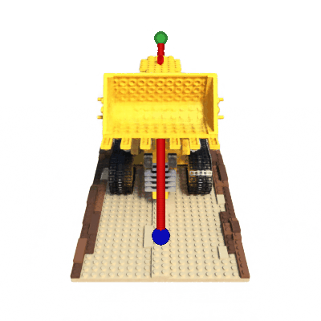

[](https://badge.fury.io/py/l4casadi)


---
# Learning 4 CasADi Framework

L4CasADi enables the seamless integration of PyTorch-learned models with CasADi for efficient and potentially
hardware-accelerated numerical optimization.
The only requirement on the PyTorch model is to be traceable and differentiable.

<div align="center">
  
  
  <br><a target="_blank" href="https://colab.research.google.com/github/Tim-Salzmann/l4casadi/blob/main/examples/nerf_trajectory_optimization/NeRF_Trajectory_Optimization.ipynb"></a>
  &nbsp;&nbsp;&nbsp;&nbsp;&nbsp;&nbsp;&nbsp;&nbsp;&nbsp;&nbsp;&nbsp;&nbsp;&nbsp;&nbsp;&nbsp;&nbsp;&nbsp;&nbsp;&nbsp;&nbsp;&nbsp;&nbsp;&nbsp;&nbsp;&nbsp;&nbsp;&nbsp;&nbsp;&nbsp;&nbsp;&nbsp;&nbsp;&nbsp;&nbsp;&nbsp;&nbsp;&nbsp;&nbsp;&nbsp;&nbsp;&nbsp;&nbsp;&nbsp;&nbsp;&nbsp;&nbsp;
  <a target="_blank" href="https://colab.research.google.com/github/Tim-Salzmann/l4casadi/blob/main/examples/fish_turbulent_flow/Fish_Turbulent_Flow.ipynb"></a>
  &nbsp;&nbsp;&nbsp;&nbsp;&nbsp;&nbsp;&nbsp;&nbsp;&nbsp;&nbsp;&nbsp;&nbsp;&nbsp;&nbsp;&nbsp;&nbsp;&nbsp;&nbsp;&nbsp;&nbsp;&nbsp;
  <p><i>Two L4CasADi examples: Collision-free trajectory through a NeRF and Navigation in Turbulent Flow</i></p>
</div>

arXiv: [Learning for CasADi: Data-driven Models in Numerical Optimization](https://arxiv.org/pdf/2312.05873.pdf)

Talk: [Youtube](https://youtu.be/UYdkRnGr8eM?si=KEPcFEL9b7Vk2juI&t=3348)

## L4CasADi v2 Breaking Changes
After feedback from first use-cases L4CasADi v2 is designed with efficiency and simplicity in mind.

This leads to the following breaking changes:

- L4CasADi v2 can leverage PyTorch's batching capabilities for increased efficiency. When passing `batched=True`,
L4CasADi will understand the **first** input dimension as batch dimension. Thus, first and second-order derivatives
across elements of this dimension are assumed to be **sparse-zero**. To make use of this, instead of having multiple calls to a L4CasADi function in
your CasADi program, batch all inputs together and have a single L4CasADi call. An example of this can be seen when
comparing the [non-batched NeRF example](examples/nerf_trajectory_optimization/nerf_trajectory_optimization.py) with the
[batched NeRF example](examples/nerf_trajectory_optimization/nerf_trajectory_optimization_batched.py) which is faster by
a factor of 5-10x.
- L4CasADi v2 will not change the shape of an input anymore as this was a source of confusion. The tensor forwarded to
the PyTorch model will resemble the **exact dimension** of the input variable by CasADi. You are responsible to make
sure that the PyTorch model handles a **two-dimensional** input matrix! Accordingly, the parameter
`model_expects_batch_dim` is removed.
- By default, L4CasADi v2 will not provide the Hessian, but the Jacobian of the Adjoint. This is sufficient for most
many optimization problems. However, you can explicitly request the generation of the Hessian by passing
`generate_jac_jac=True`.

[//]: # (L4CasADi v2 can use the new **torch compile** functionality starting from PyTorch 2.4. By passing `scripting=False`. This
will lead to a longer compile time on first L4CasADi function call but will lead to a overall faster
execution. However, currently this functionality is experimental and not fully stable across all models. In the long
term there is a good chance this will become the default over scripting once the functionality is stabilized by the
Torch developers.)

## Table of Content
- [Projects using L4CasADi](#projects-using-l4casadi)
- [Installation](#installation)
- [Quick Start](#quick-start)
- [Online Learning](#online-learning-and-updating)
- [Naive L4CasADi](#naive-l4casadi) - Use this for small Multi Layer Perceptron Models.
- [Real-time L4CasADi](#real-time-l4casadi) - Use this for fast MPC with Acados.
- [Examples](#examples)

If you use this framework please cite the following two paper
```
@article{salzmann2023neural,
  title={Real-time Neural-MPC: Deep Learning Model Predictive Control for Quadrotors and Agile Robotic Platforms},
  author={Salzmann, Tim and Kaufmann, Elia and Arrizabalaga, Jon and Pavone, Marco and Scaramuzza, Davide and Ryll, Markus},
  journal={IEEE Robotics and Automation Letters},
  doi={10.1109/LRA.2023.3246839},
  year={2023}
}
```

```
@inproceedings{{salzmann2024l4casadi,
  title={Learning for CasADi: Data-driven Models in Numerical Optimization},
  author={Salzmann, Tim and Arrizabalaga, Jon and Andersson, Joel and Pavone, Marco and Ryll, Markus},
  booktitle={Learning for Dynamics and Control Conference (L4DC)},
  year={2024}
}
```

## Projects using L4CasADi
- Real-time Neural-MPC: Deep Learning Model Predictive Control for Quadrotors and Agile Robotic Platforms <br/> [Paper](https://arxiv.org/pdf/2203.07747.pdf) | [Code](https://github.com/TUM-AAS/neural-mpc)
- AC4MPC: Actor-Critic Reinforcement Learning for Nonlinear Model Predictive Control <br/> [Paper](https://arxiv.org/pdf/2406.03995)
- Reinforcement Learning based MPC with Neural Dynamical Models <br/> [Paper](https://folk.ntnu.no/skoge/publications/2024/adhau-ecc24/ECC24_0903_FI.pdf)
- Neural Potential Field for Obstacle-Aware Local Motion Planning <br/> [Paper](https://arxiv.org/pdf/2310.16362.pdf) | [Video](https://www.youtube.com/watch?v=KL3bfvUwGqs) | [Code](https://github.com/cog-isa/NPField)
- N-MPC for Deep Neural Network-Based Collision Avoidance exploiting Depth Images <br/> [Paper](https://arxiv.org/pdf/2402.13038.pdf) | [Code](https://github.com/ntnu-arl/colpred_nmpc)
- An Integrated Framework for Autonomous Driving Planning and Tracking based on NNMPC Considering Road Surface Variations <br/> [Paper](https://ieeexplore.ieee.org/abstract/document/10571565)

If your project is using L4CasADi and you would like to be featured here, please reach out.

---
## Installation
### Prerequisites
Independently if you install from source or via pip you will need to meet the following requirements:

- Working build system: CMake compatible C++ compiler (GCC version 10 or higher).
- PyTorch (`>=2.0`) installation in your python environment.\
`python -c "import torch; print(torch.__version__)"`

### Pip Install (CPU Only)
- Ensure Torch CPU-version is installed\
`pip install torch>=2.0 --index-url https://download.pytorch.org/whl/cpu`
- Ensure all build dependencies are installed
```
setuptools>=68.1
scikit-build>=0.17
cmake>=3.27
ninja>=1.11
```

- Run\
`pip install l4casadi --no-build-isolation`

### From Source (CPU Only)
- Clone the repository\
`git clone https://github.com/Tim-Salzmann/l4casadi.git`

- All build dependencies installed via\
`pip install -r requirements_build.txt`

- Build from source\
`pip install . --no-build-isolation`

The `--no-build-isolation` flag is required for L4CasADi to find and link against the installed PyTorch.

### GPU (CUDA)
CUDA installation requires nvcc to be installed which is part of the CUDA toolkit and can be installed on Linux via
`sudo apt-get -y install cuda-toolkit-XX-X` (where `XX-X` is your installed Cuda version - e.g. `12-3`).
Once the CUDA toolkit is installed nvcc is commonly found at `/usr/local/cuda/bin/nvcc`.

Make sure `nvcc -V` can be executed and run `pip install l4casadi --no-build-isolation` or `CUDACXX=<PATH_TO_NVCC> pip install . --no-build-isolation` to build from source.

If `nvcc` is not automatically part of your path you can specify the `nvcc` path for L4CasADi.
E.g. `CUDACXX=<PATH_TO_NVCC> pip install l4casadi --no-build-isolation`.

---

## Quick Start

Defining an L4CasADi model in Python given a pre-defined PyTorch model is as easy as
```python
import l4casadi as l4c

l4c_model = l4c.L4CasADi(pyTorch_model, device='cpu')
```

where the architecture of the PyTorch model is unrestricted and large models can be accelerated with dedicated hardware.

---

## Online Learning and Updating
L4CasADi supports updating the PyTorch model online in the CasADi graph. To use this feature, pass `mutable=True` when
initializing a L4CasADi. To update the model, call the `update` function on the `L4CasADi` object.
You can optionally pass an updated model as parameter. If no model is passed, the reference passed at
initialization is assumed to be updated and will be used for the update.

---

## Naive L4CasADi

While L4CasADi was designed with efficiency in mind by internally leveraging torch's C++ interface, this can still
result in overhead, which can be disproportionate for small, simple models. Thus, L4CasADi additionally provides a
`NaiveL4CasADiModule` which directly recreates the PyTorch computational graph using CasADi operations and copies the
weights --- leading to a pure C computational graph without context switches to torch. However, this approach is
limited to a small predefined subset of PyTorch operations --- only `MultiLayerPerceptron`
models and CPU inference are supported.

The torch framework overhead dominates for networks smaller than three hidden layers, each with 64
neurons (or equivalent). For models smaller than this size we recommend using the NaiveL4CasADiModule.
For larger models, the overhead becomes negligible and L4CasADi should be used.

https://github.com/Tim-Salzmann/l4casadi/blob/f7b16fba90f4d3ee53217b560f26b47e6b23e44a/examples/naive/readme.py#L5-L9

---
## Real-time L4CasADi
Real-time L4Casadi (former `Approximated` approach in [ML-CasADi](https://github.com/TUM-AAS/ml-casadi)) is the underlying framework powering
[Real-time Neural-MPC](https://arxiv.org/pdf/2203.07747). It replaces complex models with local Taylor approximations.
For certain optimization procedures (such as MPC with multiple shooting nodes) this can lead to improved optimization times.
However, `Real-time L4Casadi`, comes with many restrictions (only Python, no C(++) code generation, ...) and is therefore not
a one-to-one replacement for `L4Casadi`. Rather it is a complementary framework for certain special use cases.

More information [here](l4casadi/realtime).

https://github.com/Tim-Salzmann/l4casadi/blob/f7b16fba90f4d3ee53217b560f26b47e6b23e44a/l4casadi/realtime/examples/readme.py#L32-L43

---

## Examples
https://github.com/Tim-Salzmann/l4casadi/blob/f7b16fba90f4d3ee53217b560f26b47e6b23e44a/examples/readme.py#L28-L40

Please note that only `casadi.MX` symbolic variables are supported as input.

Multi-input multi-output functions can be realized by concatenating the symbolic inputs when passing to the model and
splitting them inside the PyTorch function.

To use GPU (CUDA) simply pass `device="cuda"` to the `L4CasADi` constructor.

Further examples:
- Collision-free minimum snap optimized trajectory through a NeRF: [examples/nerf_trajectory_optimization](/examples/nerf_trajectory_optimization)
- Energy Efficient Fish Navigation in Turbulent Flow: [examples/fish_turbulent_flow](/examples/fish_turbulent_flow)
- Simple nonlinear programming with L4CasADi model as objective and constraints: [examples/simple_nlp.py](/examples/simple_nlp.py)
- L4CasADi in pure C(++) projects: [examples/cpp_executable](/examples/cpp_usage)
- Use PyTorch L4CasADi Model in Matlab: [examples/matlab](/examples/matlab)

---

## Acados Integration
To use this framework with Acados:
- Follow the [installation instructions](https://docs.acados.org/installation/index.html).
- Install the [Python Interface](https://docs.acados.org/python_interface/index.html).
- Ensure that `LD_LIBRARY_PATH` is set correctly (`DYLD_LIBRARY_PATH`on MacOS).
- Ensure that `ACADOS_SOURCE_DIR` is set correctly.

An example of how a PyTorch model can be used as dynamics model in the Acados framework for Model Predictive Control 
can be found in [examples/acados.py](/examples/acados.py)

To use L4CasADi with Acados you will have to set `model_external_shared_lib_dir` and `model_external_shared_lib_name`
in the `AcadosOcp.solver_options` accordingly.

```
ocp.solver_options.model_external_shared_lib_dir = l4c_model.shared_lib_dir
ocp.solver_options.model_external_shared_lib_name = l4c_model.name
```

https://github.com/Tim-Salzmann/l4casadi/blob/f7b16fba90f4d3ee53217b560f26b47e6b23e44a/examples/acados.py#L156-L160

---

## FYIs


### Warm Up

Note that PyTorch builds the graph on first execution. Thus, the first call(s) to the CasADi function will be slow.
You can warm up to the execution graph by calling the generated CasADi function one or multiple times before using it.
