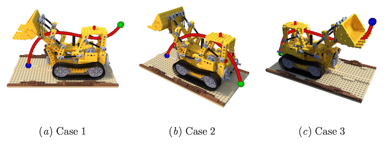

# Collision-free Trajectory Optimization in Neural Radiance Fields

<div align="center">
  
  <p><i>Collision-free minimum snap optimized trajectory through a NeRF</i></p>
</div>

Neural Radiance Fields (NeRFs) are a powerful 3D representation technique that leverages deep learning to reconstruct 3D
scenes from a collection of 2D images. NeRFs encode the scene's geometry and appearance into a continuous function,
allowing for the rendering of photorealistic images from arbitrary viewpoints. As a byproduct, the densities
(translucencies) of the scene's objects at any point in the 3D environment are implicitly captured in the network.
In this example, we demonstrate that such state-of-the-art learned models from computer vision research can be easily
incorporated into optimization procedures using \lc. To showcase this, we present the problem of finding a
collision-free trajectory through the densities represented by a learned NeRF, where densities below a predefined
threshold are deemed as unobstructed regions within the environment.

## Run the Optimization
Specify a problem configuration (start- and goal points) by changing the `CASE` variable in
`nerf_trajectory_optimization.py`.
Then run the optimization with
```python nerf_trajectory_optimization.py```

<div align="center">
  
  <p><i>Three cases of a collision-free minimum snap optimized trajectory through a NeRF</i></p>
</div>